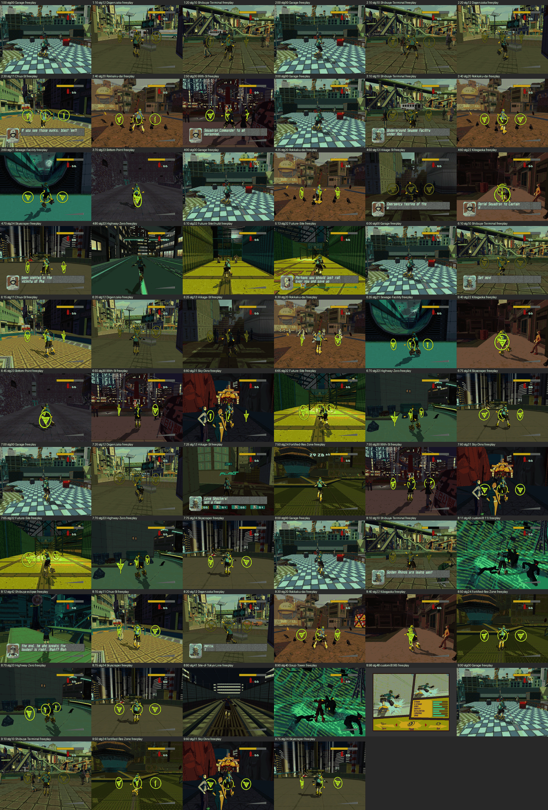

# Game map, 25 Sep 2026

Every chapter's hub and a representative mission per (chapter, stage) pair, jumped to
from the Garage with the clean-room chapter jump and left in free play for ~50 s with
nobody at the pad. HEAD 807bb0b, build-feav binary (not rebuilt), unattended,
one instance at a time, audio silenced, `RECOMP_GLITCH_WATCH=1`.

- **Coverage:** 64 targets (9 hubs + 55 stage missions) plus 4 follow-up runs, all
  finished between 03:22 and 06:25. All nine chapters and all 20 stages that
  host a free-play mission in `chapter-stage-map.txt` are covered at least once. Not
  covered: the C96 chapter intros and their 8 intro-only stages (stg08/09/18/19/28/29/38/39;
  the cutscene sweep earlier on 25 Sep ran all of them without a fault), missions
  94/95/97/99, and revisits of a stage in a chapter where it has no new content (ch3/ch4
  Chuo St, Dogenzaka, 99th St; ch7/ch8/ch9 revisits). `harness/map_targets.txt` is the list.
- **Config:** the harness adopts the player's boolean `paths.conf` switches
  (`RECOMP_METAL_FF`, `METAL_HW_TEX`, `TEXMODE_APPROX`, `DSOUND_LIFT`, ... 24 of them).
  `RECOMP_FLIP_PACE` is **on** (compiled default, not in paths.conf): flips are held to
  one 59.94 Hz period, so FRAME-WIN percentiles never go below ~16.7 ms.
  The "uncapped mean" column is the window mean minus the `[FLIP-PACE]` wait per flip:
  what the frame costs with the cap off. Percentiles cannot be uncapped from these lines;
  where the uncapped mean is above 16.7 the cap is not active and p50/p90 are real.
- **Host:** idle before the batch (no Spotlight or Time Machine above 1% in `top`).
- **Frame numbers:** from the engine's own periodic block (every ~300 flips):
  `[FRAME-WIN]` p50/p90, `[FLIP-PACE]`, `[STAGE]` per-frame vsh / prepare / submit /
  sync / snap / clear / rest (rest = guest code + pushbuffer walk, a residual). Only
  windows after the mission's last transition to 0x0F are used; the first one, which
  straddles the transition, is dropped. p50 and p90 are the medians over the ~9 windows.
- **Tools added:** `harness/map_run.sh` (one target; free-play detection, captures at
  +12 s, +32 s and at the end, hang = `[FRAME] flips` frozen for 20 s, crash = process gone;
  `MAP_PRESS_A=1` presses A at briefing cards), `harness/map_batch.sh` (runs a list,
  reruns a crash or hang once), `harness/map_report.py` (JSON per target, contact sheet).
  Run data: `~/jsrf-build/runs/map/runs/<run>/runtime.log`, `report.json` beside it.

## 1. The table

Picture verdicts are from looking at the captures (contact sheet below; each run has
three, at +12 s, +32 s and at the end of free play). "sane" means the world, characters
and HUD are drawn with no black screen, missing geometry or garbage.

| ch | stage | jump | run | free play (0x0F) | fault / hang | picture | frame ms p50 / p90 (capped) | uncapped mean ms | drops / glitches (free play) |
|---|---|---|---|---|---|---|---|---|---|
| 1 | stg00 Garage | 1:00 | m0100 | yes | none | sane | 18.0 / 20.0 | 18.0 | none |
| 1 | stg12 Dogenzaka | 1:10 | m0110 | yes | none | sane | 24.0 / 25.5 | 24.1 | none |
| 1 | stg10 Shibuya-Terminal | 1:20 | m0120 | yes | none | sane | 28.5 / 30.0 | 28.1 | none |
| 2 | stg00 Garage | 2:00 | m0200 | yes | none | sane | 18.0 / 20.0 | 18.0 | none |
| 2 | stg10 Shibuya-Terminal | 2:10 | m0210 | yes | none | sane (dense crowd) | 41.5 / 76.5 | 40.4 | none |
| 2 | stg12 Dogenzaka | 2:20 | m0220 | yes | none | sane | 23.0 / 24.0 | 22.9 | none |
| 2 | stg11 Chuo-St | 2:30 | m0230 | yes | none | sane | 17.0 / 18.5 | 17.1 | none |
| 2 | stg20 Rokkaku-dai | 2:40 | m0240 | yes | none | sane | 20.0 / 21.5 | 19.6 | none |
| 2 | stg30 99th-St | 2:50 | m0250 | yes | none | sane | 30.0 / 32.0 | 29.8 | 1 DROP lines: DROPPED vertex: fixed-function clip W ;; GLITCH 2 (0 in 0x0F) |
| 3 | stg00 Garage | 3:00 | m0300 | yes | none | sane | 18.0 / 20.0 | 17.9 | none |
| 3 | stg10 Shibuya-Terminal | 3:10 | m0310 | yes | none | sane | 27.0 / 28.5 | 26.8 | none |
| 3 | stg20 Rokkaku-dai | 3:40 | m0340 | yes | none | sane | 18.5 / 20.0 | 18.3 | none |
| 3 | stg21 Sewage-Facility | 3:60 | m0360 | yes | HANG at flip 4876 (log line 51730), in free play | frozen after ~10 s of free play (same frame in all captures) | 17.0 / 18.0 | 12.2 | none |
| 3 | stg21 Sewage-Facility | 3:60 | m0360.rerun | yes | none | sane | 17.0 / 18.0 | 12.4 | none |
| 3 | stg23 Bottom-Point | 3:70 | m0370 | yes | none | sane | 17.0 / 19.0 | 10.7 | none |
| 4 | stg00 Garage | 4:00 | m0400 | yes | none | sane | 18.0 / 20.0 | 18.0 | none |
| 4 | stg20 Rokkaku-dai | 4:25 | m0425 | yes | none | sane | 18.5 / 20.0 | 18.4 | none |
| 4 | stg13 Hikage-St | 4:50 | m0450 | yes | none | sane | 17.0 / 18.5 | 11.5 | 11 DROP lines: DROPPED vertex: fixed-function clip W ;; GLITCH 1 (1 in 0x0F) |
| 4 | stg22 Kibogaoka | 4:60 | m0460 | yes | none | sane | 17.0 / 17.5 | 13.5 | none |
| 4 | stg34 Skyscraper | 4:70 | m0470 | yes | none | sane | 81.5 / 83.0 | 75.4 | none |
| 4 | stg33 Highway-Zero | 4:80 | m0480 | no (budget, ends 0x3D in mssn04481) | none | briefing card 'Press the A Button' (waits for input; not a defect) | 17.0 / 20.5 | 7.8 | none |
| 4 | stg33 Highway-Zero | 4:80 | m0480.pressA | yes | none | sane | 17.0 / 17.0 | 15.0 | none |
| 5 | stg32 Future-Site(hub) | 5:10 | m0510 | yes | none | sane | 17.0 / 17.5 | 13.4 | none |
| 5 | stg32 Future-Site | 5:13 | m0513 | yes | none | sane | 17.0 / 18.5 | 11.7 | none |
| 6 | stg00 Garage | 6:00 | m0600 | yes | none | sane | 18.0 / 20.0 | 17.9 | none |
| 6 | stg10 Shibuya-Terminal | 6:10 | m0610 | yes | none | sane | 27.0 / 28.5 | 26.9 | none |
| 6 | stg11 Chuo-St | 6:15 | m0615 | yes | none | sane | 17.0 / 17.5 | 15.8 | none |
| 6 | stg12 Dogenzaka | 6:20 | m0620 | yes | none | sane | 22.0 / 23.0 | 21.7 | none |
| 6 | stg13 Hikage-St | 6:25 | m0625 | yes | none | sane | 17.0 / 18.5 | 11.0 | 10 DROP lines: DROPPED vertex: fixed-function clip W ; |
| 6 | stg20 Rokkaku-dai | 6:30 | m0630 | yes | none | sane | 22.0 / 23.5 | 21.9 | none |
| 6 | stg21 Sewage-Facility | 6:35 | m0635 | yes | none | sane | 17.0 / 18.0 | 12.3 | none |
| 6 | stg22 Kibogaoka | 6:40 | m0640 | yes | none | sane | 17.0 / 18.0 | 12.9 | none |
| 6 | stg23 Bottom-Point | 6:45 | m0645 | yes | none | sane | 17.0 / 19.0 | 10.6 | none |
| 6 | stg30 99th-St | 6:55 | m0655 | yes | none | sane | 31.0 / 32.5 | 30.9 | none |
| 6 | stg31 Sky-Dino | 6:60 | m0660 | yes | none | sane | 98.5 / 99.5 | 98.1 | GLITCH 8 (0 in 0x0F) |
| 6 | stg32 Future-Site | 6:65 | m0665 | yes | none | sane | 17.0 / 19.0 | 10.3 | none |
| 6 | stg33 Highway-Zero | 6:70 | m0670 | yes | none | sane | 17.0 / 17.5 | 13.9 | none |
| 6 | stg34 Skyscraper | 6:75 | m0675 | yes | none | sane | 31.0 / 32.0 | 32.6 | none |
| 7 | stg00 Garage | 7:00 | m0700 | yes | none | sane | 18.0 / 20.5 | 18.0 | none |
| 7 | stg12 Dogenzaka | 7:20 | m0720 | yes | none | sane | 23.0 / 24.0 | 23.0 | none |
| 7 | stg13 Hikage-St | 7:25 | m0725 | no (budget, ends 0x3D in mssn07726) | none | briefing card (flag game) waiting for A; not a defect | 17.0 / 20.0 | 8.4 | 1 DROP lines: DROPPED vertex: fixed-function clip W ; |
| 7 | stg13 Hikage-St | 7:25 | m0725.pressA | yes | none | sane (flag game HUD) | 17.0 / 18.5 | 11.9 | none |
| 7 | stg24 Fortified-Res-Zone | 7:50 | m0750 | yes | none | sane | 17.0 / 18.5 | 16.6 | none |
| 7 | stg30 99th-St | 7:55 | m0755 | yes | none | sane | 31.5 / 33.0 | 31.2 | none |
| 7 | stg31 Sky-Dino | 7:60 | m0760 | yes | none | sane | 109.0 / 110.5 | 109.1 | none |
| 7 | stg32 Future-Site | 7:65 | m0765 | yes | none | sane | 17.0 / 19.0 | 10.3 | none |
| 7 | stg33 Highway-Zero | 7:70 | m0770 | yes | none | sane | 17.0 / 17.5 | 15.0 | none |
| 7 | stg34 Skyscraper | 7:75 | m0775 | yes | none | sane | 33.0 / 34.0 | 36.9 | none |
| 8 | stg00 Garage | 8:00 | m0800 | yes | none | sane | 18.0 / 20.0 | 17.9 | none |
| 8 | stg10 Shibuya-Terminal | 8:10 | m0810 | yes | none | sane | 27.5 / 29.0 | 27.5 | 3 DROP lines: DROPPED vertex: fixed-function clip W ; |
| 8 | stg43 custom(8:11) | 8:11 | m0811 | yes | none | stylised green arena, sane-looking | 20.0 / 21.5 | 19.7 | GLITCH 1 (0 in 0x0F) |
| 8 | stg42 Shibuya-eclipse | 8:12 | m0812 | no (budget, ends 0x3D in mssn0812) | none | briefing card waiting for A; not a defect | 17.0 / 20.0 | 11.1 | 2 DROP lines: DROPPED vertex: fixed-function clip W ; |
| 8 | stg42 Shibuya-eclipse | 8:12 | m0812.pressA | yes | none | sane | 19.5 / 21.0 | 20.0 | 3 DROP lines: DROPPED vertex: fixed-function clip W ; |
| 8 | stg11 Chuo-St | 8:15 | m0815 | yes | none | sane | 17.5 / 19.0 | 17.3 | none |
| 8 | stg12 Dogenzaka | 8:20 | m0820 | yes | none | sane | 24.5 / 25.0 | 24.0 | none |
| 8 | stg20 Rokkaku-dai | 8:30 | m0830 | yes | none | sane | 20.0 / 21.5 | 20.0 | none |
| 8 | stg22 Kibogaoka | 8:40 | m0840 | yes | none | sane | 17.0 / 18.0 | 13.0 | none |
| 8 | stg24 Fortified-Res-Zone | 8:50 | m0850 | yes | none | sane | 20.0 / 21.5 | 20.0 | none |
| 8 | stg33 Highway-Zero | 8:70 | m0870 | yes | none | sane | 17.0 / 17.5 | 13.6 | none |
| 8 | stg34 Skyscraper | 8:75 | m0875 | yes | none | sane | 33.0 / 34.0 | 36.9 | none |
| 8 | stg41 Site-of-Tokyo-Line | 8:80 | m0880 | yes | none | sane | 17.0 / 17.5 | 12.9 | 1 DROP lines: SIMPLIFIED raster: attenuated point size drawn at the constant size ; |
| 8 | stg40 Gouji-Tower | 8:90 | m0890 | yes | none | stylised green arena, near-identical to 8:11 -- check | 20.0 / 21.5 | 19.8 | none |
| 8 | stg48 custom(8:98) | 8:98 | m0898 | yes | none | character-select screen (mission hands to 0895); sane | 21.5 / 28.5 | 22.6 | 9 DROP lines: DROPPED vertex: fixed-function clip W ; |
| 9 | stg00 Garage | 9:00 | m0900 | yes | none | sane | 18.0 / 20.0 | 17.9 | none |
| 9 | stg10 Shibuya-Terminal | 9:10 | m0910 | yes | none | sane | 30.0 / 31.0 | 29.4 | none |
| 9 | stg24 Fortified-Res-Zone | 9:50 | m0950 | yes | none | sane | 18.5 / 20.0 | 18.3 | none |
| 9 | stg31 Sky-Dino | 9:60 | m0960 | yes | none | sane | 109.5 / 111.0 | 109.3 | none |
| 9 | stg34 Skyscraper | 9:75 | m0975 | yes | none | sane | 33.0 / 34.0 | 36.8 | none |

Glitch counts only include hits after the jump fired. None of them is in free play
except m0450 (one frame, below). The hits at guest frames ~3940 (m0660: 8 hits) are the
jump's own scene change. m0250 and m0811 are in cutscenes (state 0x13).

## 2. Problems, most severe first

1. **Hang in free play, intermittent: Sewage Facility (3:60).** Once in 2 runs. About
   10 s into free play the guest stopped flipping (`[FRAME] flips=4876` in the last 8
   reports) while the periodic report kept printing. So this is not a process freeze.
   It is also **not** the ADX-guard spin: kernel calls kept rising slowly (440k→526k,
   not 1e9) and ADX-GUARD shows matched locks with nothing held. `[PB-ACK]` reports
   `not-consumed` climbing with "already frozen (fence healthy)". The guest is idle and
   waiting, not spinning. The rerun (`m0360.rerun`) reached free play and ran 50 s clean.
   Evidence: `runs/m0360/runtime.log` from line 51730; captures `m0360/picture-40..42.bmp`
   are identical. Note: the launcher's hang detector (60 s at the time) missed it
   because free play ended first. That is now 20 s, and `map_report.py` flags any
   run whose last `[FRAME]` reports repeat.
2. **Sky Dino is at ~10 fps: 98–110 ms a frame in every chapter (6:60, 7:60, 9:60).**
   `submit` is 73–82 ms of it. At the same time `[METAL] hw textures` rebuilds
   **107–110 textures per frame (33–37 MiB decoded per frame)**, and `[METAL] texture buffers`
   re-uploads ~5,500 textures per window, while `texture cache ... changed` stays
   constant (the textures are not being rewritten). Every other stage rebuilds 0.
   Hypothesis, **not verified**: the 128-slot `TEXTURE_CACHE_SIZE` (nv2a_metal.m:541)
   is smaller than the stage's per-frame working set, so slots are recycled every frame
   and each recycle re-decodes the texture. Test: raise the constant and re-run
   `map_run.sh m0660x 6:60 50 360`. Evidence: `runs/m0660`, `m0760`, `m0960`.
3. **Skyscraper / Pharaoh Park has the same signature, milder.** 4:70 runs at 75 ms
   (submit 55 ms, 71 textures rebuilt per frame). 6:75 to 9:75 run at 33–37 ms (submit
   12–18 ms, 4–6 rebuilt per frame), with p90 peaks of 59–80 ms in some windows.
   Evidence: `runs/m0470`, `m0675`, `m0775`, `m0875`, `m0975`.
4. **Shibuya Terminal slowed down late in one run (2:10).** For 25 s it was steady at
   26–27 ms. Then four windows at 48–158 ms mean (p90 up to 128 ms, 6–20 fps) with
   `rest` (guest side) at 27–119 ms, while vsh and submit barely moved. The other five
   Shibuya runs (1:20, 3:10, 6:10, 8:10, 9:10) stayed at 27–30 ms throughout. The host
   was not checked at that moment, so it may be external. Evidence:
   `runs/m0210/runtime.log` lines 70326–92125.
5. **Shibuya Terminal, 99th St and Dogenzaka never reach 60 fps.** Shibuya is 27–30 ms
   (~35 fps), 99th St 30–31 ms (~32 fps), Dogenzaka 22–24 ms, Rokkaku-dai 18–22 ms,
   and even the Garage is 18 ms (55 fps). The cost is spread across vsh ≈ submit ≈ rest
   (~8–9 ms each) plus sync 2–4 ms. There is no single stage to cut.
6. **`[DROP]` vertex: fixed-function clip W.** A few batches, in Hikage St (4:50: 11
   report lines, 6:25: 10), Shibuya (8:10), 99th St (2:50), 8:98, 7:25, 8:12. It is below the
   1% WARNING threshold everywhere: no WARNING lines, no state dumps.
   **Simplified raster** (attenuated point size drawn at constant size) once in 8:80.
   **No `[TEXFMT]` refusals in any run.**
7. **One-frame dropout of the speaker portrait as a dialogue box opens (Hikage St, 4:50).**
   The only free-play glitch hit: `runs/m0450/glitch/glitch-002/frame-6142.bmp` has no
   portrait, while 6141 and 6143 have one. The draw count is the same (170) in all three.
   It could be the title's own fade. Unconfirmed.
8. **Briefing cards stop the mission (4:80, 7:25, 8:12).** The mission hands off to a
   card ("Press the A Button", state 0x3C/0x3D) and waits for A. This is not a defect.
   `MAP_PRESS_A=1` reruns got all three into free play with sane pictures.
   Log cosmetic: `[CHAPTER-JUMP]` prints the follow-on mission as `mssn04481`,
   `mssn07726`, `mssn08895` (chapter digits prepended to a three-digit mission number).
9. **8:90 (Gouji Tower) looks almost the same as 8:11 (stg43).** Both show the green
   swirl arena with the Rhinos. It may be correct (the final arena), but it is worth
   a look against xemu.

No guest faults, no crashes, and no `FIRST GUEST FAULT` in any of the 68 runs. Every
jump fired on the first attempt (no title-input flake).

## 3. The slowest five stages

Per-frame milliseconds, means over the free-play windows (FLIP_PACE on; none of these
is ever capped, so p50/p90 are real).

| stage (run) | p50 / p90 | mean | vsh | submit | sync | rest (guest) | hw textures rebuilt / MiB decoded per frame |
|---|---|---|---|---|---|---|---|
| Sky Dino (7:60, m0760) | 109.0 / 110.5 | 109.1 | 14.3 | **81.9** | 3.2 | 9.4 | 110 / 37.1 |
| Sky Dino (6:60, m0660) | 98.5 / 99.5 | 98.1 | 12.2 | **73.5** | 4.0 | 8.2 | 107 / 32.9 |
| Skyscraper (4:70, m0470) | 81.5 / 83.0 | 75.4 | 11.5 | **54.6** | 1.6 | 7.9 | 71 / 25.3 |
| Shibuya Terminal (2:10, m0210) | 41.5 / 76.5 | 40.4 | 10.7 | 9.8 | 2.9 | **36.2** | 0 |
| Skyscraper (7:75 / 8:75, m0775) | 33.0 / 34.0 | 36.9 | 12.3 | 17.5 | 2.5 | 8.3 | 6.2 / 2.4 |
| 99th St (7:55, m0755) | 31.5 / 33.0 | 31.2 | 8.9 | 8.8 | 4.2 | 9.0 | 0 |
| Shibuya Terminal (9:10, m0910; typical) | 30.0 / 31.0 | 29.4 | 10.2 | 8.4 | 2.7 | 8.0 | 0 |

Stage-for-stage, the order is Sky Dino, then Skyscraper, then Shibuya Terminal, then
99th St, then Dogenzaka (22–24 ms: vsh 7.8, submit 6.8, rest 6.1, sync 2–3).
`prepare`, `snap` and `clear` are ≤0.2 ms everywhere.

## 4. Contact sheet

`GAME_MAP_2026-09-25.png`: one capture per run (the +32 s free-play capture where
there is one), labelled with jump, stage and how the run ended. Full-size originals
are in `~/jsrf-build/runs/map/runs/<run>/picture-*.bmp`.

